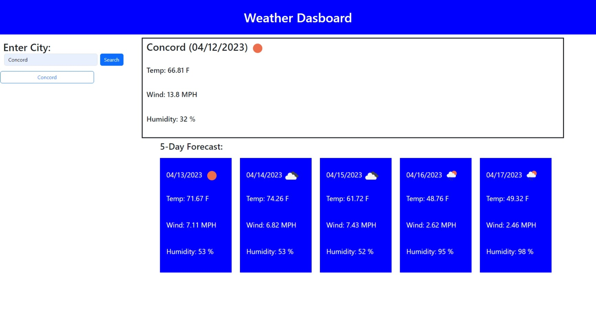

# Weather Dashboard

## Description

The purpose of this website is to allow the user to look up any cities current and future weather. It will show the user the name, temperature, wind speed, date, icon and humidity of that city. It will also show the same info for the next five days in that area. 

## Installation

No steps needed to install. Just follow this URL to get to website.
URL: https://alfredoji.github.io/weather-dashboard/

## Usage

The user will enter the name of the city in the search box on the left. After clicking the search button the user will be shown the name, temperature, wind speed, icon, date, and humidity for the current day. The user will also be shown the same information but for the next five days.The past cities will be show on the left side of the website were the user can click on them to go back to them.

## Image

